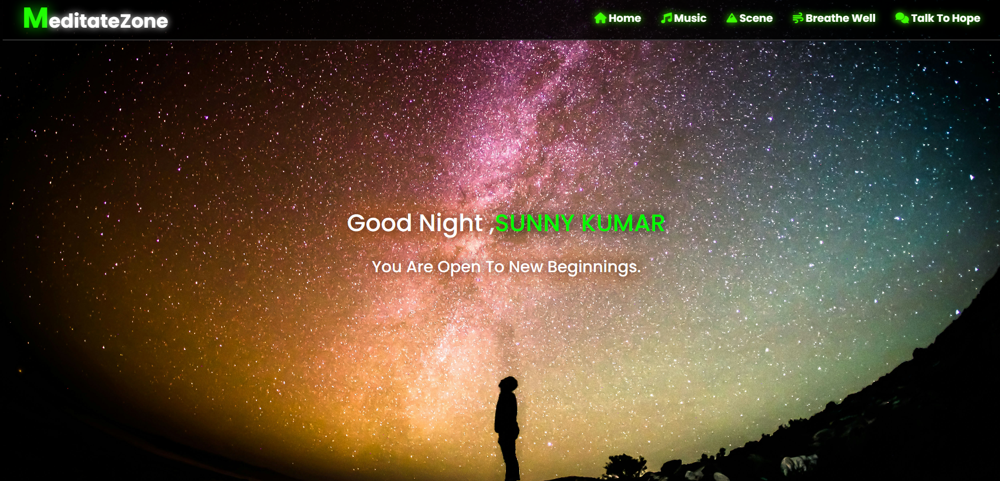
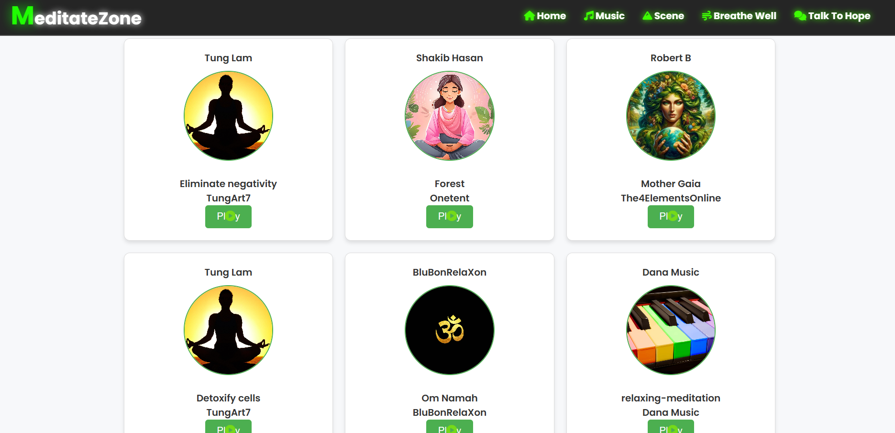
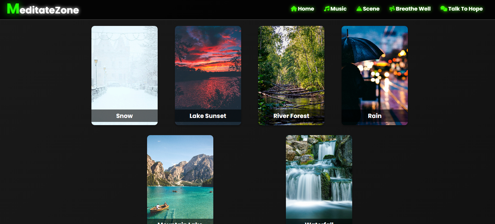
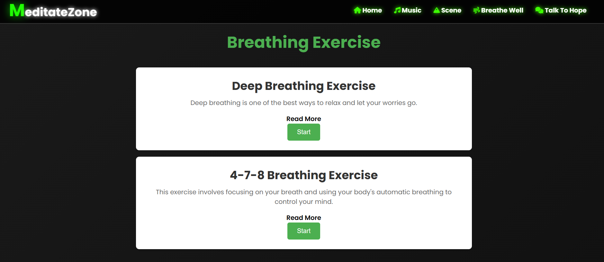
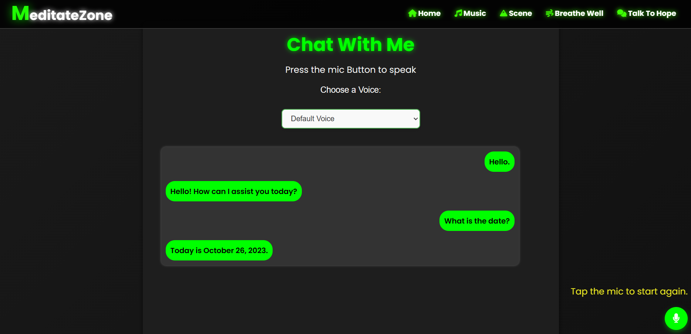

# MeditateZon 🌿

Welcome to **MeditateZon** — a serene meditation application designed to bring peace and mindfulness to your day. Built with **HTML**, **CSS**, and **JavaScript**, this app integrates interactive features, APIs, and a soothing user interface to enhance your meditation experience.

Hosted Link: [MeditateZon](https://meditatezone.netlify.app)

---

## 🧘 Features
1. **Index Page**  
   - A welcoming landing page introducing the app and its features.

2. **Music Page**  
   - Relaxing music playlists to calm your mind.  
   - Controls for playing, pausing, and selecting tracks.

3. **Scene Page**  
   - Beautiful visual scenes to help you focus or unwind.  
   - Includes serene nature visuals and animations.

4. **Breath Page**  
   - Guided breathing exercises to reduce stress and improve focus.  
   - Interactive visuals for inhale and exhale prompts.

5. **Chat Bot Page**  
   - An AI-powered chatbot to answer your queries and provide suggestions for mindfulness activities.  
   - Features:
     - Joke API integration for light-hearted moments.  
     - Gemini API integration for advanced AI responses.

---

## 🛠️ Technologies Used
- **HTML**: Structure of the app.
- **CSS**: Styled the app for a clean and relaxing UI/UX.
- **JavaScript**: Brought interactivity and dynamic features.
- **APIs Used**:
  - **[Joke API](https://api-ninjas.com/api/dadjokes)**: Provides random jokes for the chatbot.
  - **Gemini API**: Powers the chatbot with AI-driven responses.

---

## 🌐 Hosted Link
Access the app here: [MeditateZon](https://meditatezone.netlify.app)

---

## 📸 Screenshots
1. **Index Page**  
    
2. **Music Page**  
    
3. **Scene Page**  
    
4. **Breath Page**  
     
5. **Chat Bot Page**  
    
6. **Chat Bot Page**  
     

---

## 🎯 How to Use
1. Navigate through the app using the menu.
2. Select your desired activity:
   - Play relaxing music.
   - View calming scenes.
   - Practice guided breathing.
   - Chat with the bot for advice, jokes, or insights.
3. Customize your meditation experience as per your mood.

---

## 🚀 Future Enhancements
- Adding more music tracks and scenes.
- Advanced chatbot capabilities.
- Multi-language support for global users.

---

## 👨‍💻 Developer
**Sunny Kumar**  
- GitHub: [SunnyKumar-code](https://github.com/SunnyKumar-code)  
- LinkedIn: [Your LinkedIn Profile](https://www.linkedin.com/in/sunny-kumar-coder/)

---

## 📜 License
This project is licensed under the [MIT License](LICENSE).

Enjoy mindfulness with **MeditateZon**! 🌿

